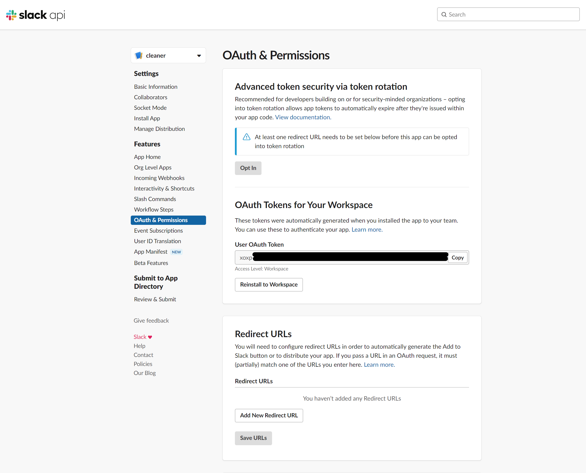
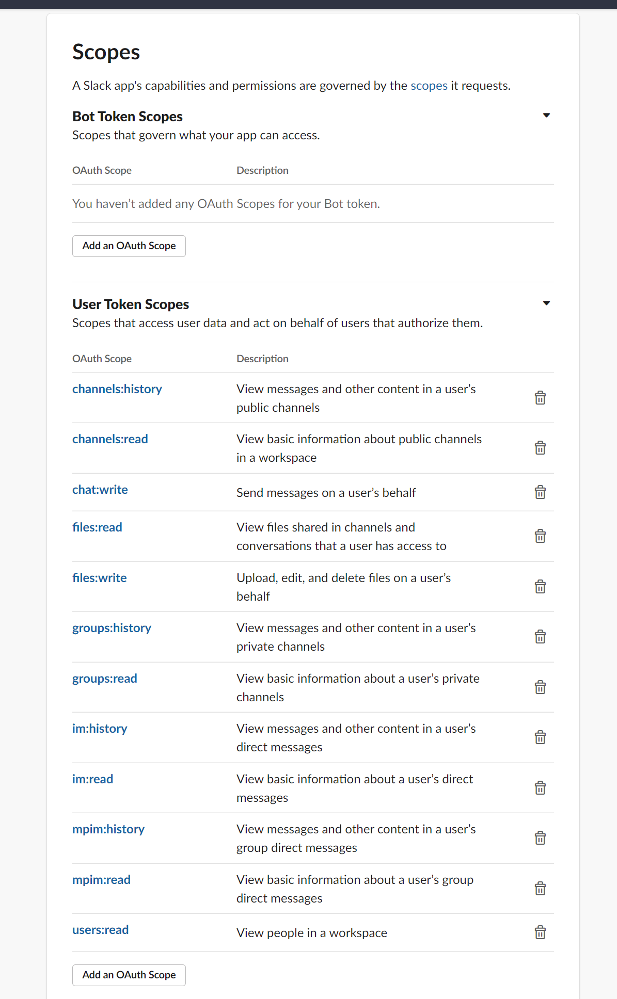

# Whut?

Delete old messages and files from your Slack workspace.

# Setup Slack

1. Create a new Slack app.

2. Create a new OAuth Access Token for the app:

   

3. Add the following User Token scopes:

   - channels:history - View messages and other content in a user’s public channels
   - channels:read - View basic information about public channels in a workspace
   - chat:write - Send messages on a user’s behalf
   - files:read - View files shared in channels and conversations that a user has access to
   - files:write - Upload, edit, and delete files on a user’s behalf
   - groups:history - View messages and other content in a user’s private channels
   - groups:read - View basic information about a user’s private channels
   - im:history - View messages and other content in a user’s direct messages
   - im:read - View basic information about a user’s direct messages
   - mpim:history - View messages and other content in a user’s group direct messages
   - mpim:read - View basic information about a user’s group direct messages
   - users:read - View people in a workspace

   

# Run

```bash
# Delete messages and files posted by `massamun` before May 1, 2020 00:00 UTC,
# in all public, private, multiparty (group) and DM channels.
#
# NOTE: It's a DRY-RUN. Nothing is actually deleted unless you also pass the --commit flag.
#
docker run --rm anrid/slackclean --user massamun --before 20200501-0000 --token xoxp-...

# Delete messages and files posted before May 1, 2020 00:00 UTC, in all public, private,
# multiparty (group) and DM channels where the channel name matches the regexp `/tech/i`.
#
docker run --rm anrid/slackclean --filter tech --before 20200501-0000 --token xoxp-...
```

# Build

```bash
docker build -t slackclean -t anrid/slackclean:latest .
```
